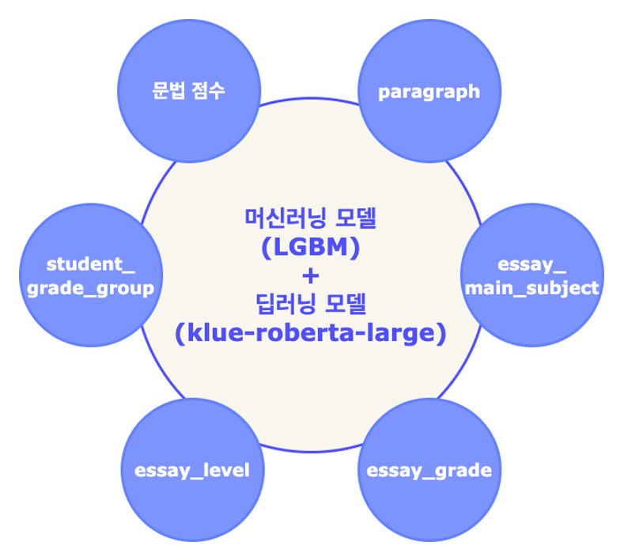

# 🥇 [인공지능 모델 알고리즘 개발 해커톤 - 에세이 글 데이터](https://dataton.gabia.io/sub.php?code=6&mode=view&no=19&category=&page=1&search=&keyword=)

---
## 🙋‍♂️팀원 소개
|김다영|김다인|박재형|정민지|최석민|
| :---: | :---: | :---: | :---: | :---: | 
| <a href="https://github.com/keemdy" height="5" width="10" target="_blank"> | <a href="https://github.com/danny980521" height="5" width="10" target="_blank">| <a href="https://github.com/Jay-Ppark" height="5" width="10" target="_blank">| <a href="https://github.com/minji-o-j" height="5" width="10" target="_blank">| <a href="https://github.com/RockMiin" height="5" width="10" target="_blank">|
|EDA|DL 모델링,  Data 전처리,  발표|Data 전처리,  맞춤법과 띄어쓰기를  이용한 feature 생성|EDA,  조사를 이용한  feature 생성|DL, ML 모델링| <!--***여기에 각자 역할 적어!-->

---
## 🎈 주제 및 대회 목적
- 인간이 평가하는 수준의 에세이 자동 평가 모델 구축 필요, 이를 통해 전문 교사가 평가하는 수준의 자동 점수 평가 모델이 구축 목표  
- 인공지능 학습용 데이터를 활용한 인공지능 알고리즘 개발 & 인공지능 응용서비스 활용 계획을 통해 인공지능 학습용 데이터 구축 기술개발과 사업화를 위한 창의적인 아이디어 확대  
  
---
## ✏ 데이터 소개  
* 원천데이터  
    * 특정 주제를 가지고 작성한 논술 형식의 에세이 글 5만개 이상 (대상 초등 고학년 및 중고생)  
* 학습데이터  
    * 수집한 텍스트를 각 문장 단위 또는 단락 단위로 구조화  
    * 에세이 글 전체와 각 단락별 내용을 3인 이상의 전문교사가 평가한 점수  
    * 4만건은 평가점수만 표기하고, 1만건에 대해서는 교정(첨삭)된 내용을 포함하여 구축  
    
---
## 💻 프로젝트 내용  
### 1. 구현하고자 하는 것  
에세이의 문맥과 문법을 모두 고려하는 **에세이 등급 자동 분류기**  

### 2. Model Algorithm  
* **klue/roberta-large** : 에세이의 문맥을 고려하여 등급 분류  

* **LightGBM** : 에세이의 문법적 요소를 수치화한 feature로 등급 분류  

  

### 3. Passage Data 전처리  
* 정규표현식을 이용하여 html 태그 제거  
    * ex) ``, `
`  
* html 특수코드를 실제 표현으로 변환  
  * `&lt;` --> `<`
  
  * `&gt;` --> `>`
  
  * `&nbsp;` --> `‘`
  
  * `&amp;` --> `&`
  
    

### 4. Feature Engineering  
#### 1) 띄어쓰기  
* PyKoSpaci를 이용해서 **띄어쓰기** 검사 후 달라진 개수를 feature로 사용.  
    * 학생이 쓴 글: 그럼싸움이나서 다투게 되고 서로사이가막막해진다.  
    * 첨삭된 글 : 그럼 싸움이 나서 다투게 되고 서로 사이가 막막해진다.  

#### 2) 문법 교정  
* PyHanspell를 이용, 하지만 띄어쓰기도 같이 해주기 때문에 f1 score를 이용하면 index 문제로 사용할 수 없음. Rouge-L score를 이용하여 띄어쓰기를 제외한 **문법**만 틀린 것을 이용하여 feature로 사용.  
    * 학생이 쓴 글: 하늘을 날아다니는 드론들이 도로에 나와 돌아다닐 꺼 같다.  
    * 첨삭된 글: 하늘을 날아다니는 드론들이 도로에 나와 돌아다닐 거 같다.  

#### 3) 문장 부호
* 맨 마지막이 문장 부호로 끝나는지 검사
* 중복된 문장기호가 있는가 검사
    * 나는 뭐하는거야`?!` 하며 화를 냈다.
        * MeCab Pos Tagging: `('?', 'SF'), ('!', 'SY')`
        * `('?', 'SF'), ('!?!!', 'SY')`, `('.', 'SF'), ('........', 'SY')` 중복된 문장기호의 경우 모두 SY로 tagging되는 것을 확인함.
    * 따옴표와 특수문자가 결합된 경우 본 점수에 해당하지 않게끔 전처리 진행.
    
#### 4) 어미  
* 문장은 종결어미로 끝나야 함.
* 문장 종결 부호가 없이 종료된 경우 **연결어미**로 pos tagging이 되기 때문에 다른 처리가 필요.
* 같은 문장이더라도 마지막 문장부호(SF)여부에 따라 종결어미 (EF)이 되기도, 연결어미(EC)가 되기도 함.
    * MeCab Pos Tagging: `('친구', 'NNG'), ('가', 'JKS'), ('될', 'VV+ETM'), ('수', 'NNB'), ('있', 'VV'), ('다', 'EF'), ('.', 'SF')`
    * MeCab Pos Tagging: `('친구', 'NNG'), ('가', 'JKS'), ('될', 'VV+ETM'), ('수', 'NNB'), ('있', 'VV'), ('다', 'EC')`

#### 5) 어순  
* 주격조사 앞에는 체언이 있어야 함.
* 보격조사 앞에는 체언이 있어야 함.
* 목적격조사 뒤에 일부 체언이 있으면 어색함.
    * Ex) 목적격 조사의 예시
        * 학생이 쓴 글: `('바다', 'NNG'), ('를', 'JKO'), ('사람', 'NNG'), ('들', 'XSN'), ('은', 'JX')`
        
        * 첨삭된 Data: `('사람', 'NNG'), ('들', 'XSN'), ('은', 'JX'), ('바다', 'NNG'), ('를', 'JKO')`
        
          

### 5. Modeling

 

* 딥러닝 모델과 머신러닝 모델 하나만 사용하여 문맥과 문법을 둘 다 고려할 수 없다고 판단.
* **문법적인 요소**는 수치상으로 표현이 가능하며 정형 데이터 형식으로 데이터를 만들 수 있어 **머신러닝 모델**을 사용하기로 결정함.
* **딥러닝 모델**에서는 **문맥적인 요소**를 고려하도록 모델을 구성함.
* 머신러닝 모델과 딥러닝 모델에 input값을 다르게 넣어줌으로써 각기 다른 방향성으로 에세이를 평가하게 유도함. 그 뒤에 **앙상블**을 진행하여 **모든 요소를 고려**할 수 있도록 구성함.
    * 딥러닝 : 에세이 원문
    
    * 머신러닝 : 위에 추가한 문법적인 feature + 채점 기준이 되는 가중치
    
      
    

### 6. Metric
* 사람마다 평가 기준이 다른 에세이의 Metric을 정하는 부분에서 어려움이 많았음.

* 실제 에세이 평가는 상대적이라 판단을 하고, 채점을 진행하는 집단의 **상위 Score부터 25%씩 4개의 등급(A, B, C, D)**을 매김.

* 기존 Score 기준으로 매긴 등급과 예측한 Score 기준으로 매긴 등급의 일치함을 기준으로 **Accuracy**를 산출하였고 이를 평가 Metric으로 사용.

  
### 7. 결과 (Accuracy)
* ML(LightGBM) : 38.8%

* DL(RoBERTa-Large) : 42%

  

---
## 🏆 결과
### 1위

---
## 🔥 느낀점
- **김다영**: 데이터의 정제가 원하는 방향으로 되어있지 않아서 정리하는 데에 어려움이 있었다. 이번 해커톤을 통해 문법이 아닌 문맥 같은 글의 다양한 을 평가하는 프로젝트에 욕심도 생겼다.
- **김다인**: 생각보다 Accuracy가 너무 안 나온 점이 가장 아쉽다. 점수를 올리는 여러가지 방법들을 시간 문제로 적용하지 못했기에 다음엔 이러한 부분에 더욱 신경써야겠다.
- **박재형**: 에세이 데이터를 평가하기 위해 feature를 만들어도 실제 점수에 영향이 있는지 판단하는 것이 매우 어려웠지만 재미있었다. 모델 결과가 많이 낮아서 조금 아쉽지만 짧은 시간 내에 다양한 실험을 할 수 있어서 좋았다.
- **정민지**: 텍스트 자동 평가에 대한 정보가 생각보다 많이 없는 것에 놀랐고, 평가 아이디어를 내는 과정이 어려웠다. 그래도 짧은 시간에 재미있게 참여한 대회인 것 같다.
- **최석민**: 주어진 짧은 시간내에 결과물을 내야한다는 것이 어려웠던 것 같다. 실제 데이터에 맞는 평가 지표와 모델링을 하는 것은 어려웠지만, 팀원들과 함께여서 좋은 성과까지 낼 수 있었다.
